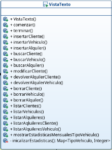
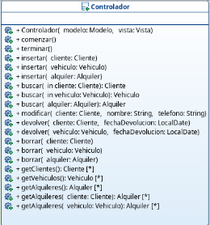
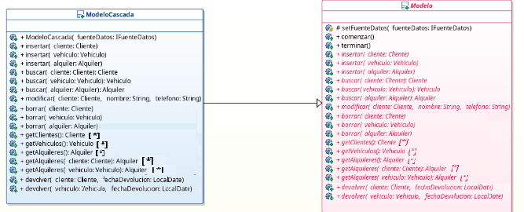
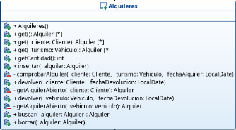
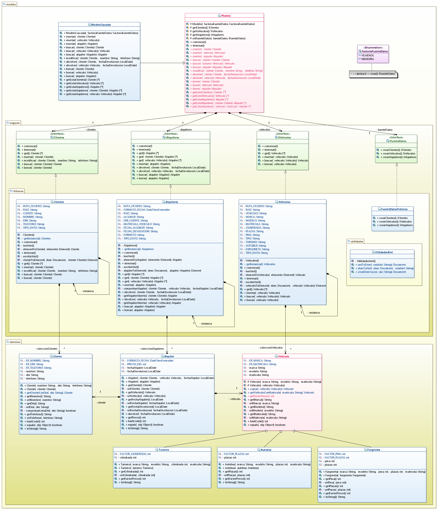
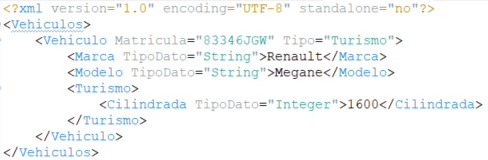
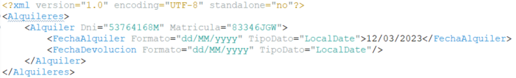

# Tarea: Alquiler de vehículos (v2)
## Profesor: Juan Antonio Muñoz Almansa
## Alumno: Pedro Patricio Cárdenas Figueroa

A nuestro cliente le ha gustado bastante la aplicación desarrollada hasta ahora. Sin embargo, nos comenta que debemos realizar algunas mejoras a la anterior versión y nuevas funcionalidades que le gustaría que tuviese. Todo ello será abordado en este **tercer spring**.

Lo primero que nos comenta es que la forma en que se realizan las devoluciones de  los alquileres no es operativa y que le gustaría poder realizarlas simplemente indicando el cliente que la quiere realizar (su DNI) o el vehículo que se quiere devolver (su matrícula). 

Otra cosa que le gustaría al cliente es que la aplicación ofreciese estadísticas mensuales por el tipo de vehículo.

Para llevar a cabo estas modificaciones, debes realizar las siguientes pasos:

#### Enumerado Accion

Añade las tres nuevas acciones que puede realizar el usuario: 

1.-**DEVOLVER_ALQUILER_CLIENTE**: Devuelve el alquiler realizado por un cliente a partir del dni del mismo.

2.-**DEVOLVER_ALQUILER_VEHICULO**: Devuelve el alquiler del vehículo a partir de la matrícula del mismo. 

3.-**MOSTRAR_ESTADITICAS_MENSUALES**: Muestra estadísticas mensuales por tipo de vehículo.

#### Vista Texto

1.-Modifica la clase `VistaTexto` para se puedan realizar las devoluciones por cliente o por vehículo y no por alquiler.

2.-Implementa el método `inicializarEstadisticas` que devolverá un Mapa de tipo `EnumMap`, cuya clave será el tipo de vehículo y que tendrá inicialmente un valor 0 para todos los tipos de vehículos.

3.-Implementa el método `mostrarEstadisticasMensualesTipoVehiculo` que utilizará el método `inicializarEstadisticas` para inicializar el mapa, y que mostrará por pantalla el número total de veces que ha sido alquilado cada vehículo en el mes indicado por el usuario (debe usarse el método `leerMes` de la clase `Consola`).

#### Controlador

Modifica la clase `Controlador` para que se puedan realizar devoluciones por cliente y por vehículo.

#### Modelo y ModeloCascada

Modifica las clases `Modelo` y `ModeloCascada` para que se puedan realizar devoluciones por cliente y por vehículo.

#### Alquileres

Elimina el anterior método `devolver` de la clase `Alquileres` e implementa los dos nuevos métodos devolver para un cliente dado y para un turismo dado tal y como pedía nuestro cliente. Deberás implementar los métodos `getAlquilerAbierto` para un cliente dado y para un turismo dado y que se usarán en los métodos anteriores. Lógicamente, también deberás actualizar la interfaz `IAlquileres`. Realiza un commit.

Nuestro cliente está tan encantado con nuestro trabajo que  nos pide que por favor añadamos persistencia a los datos introducidos, ya que tal y como está ahora la aplicación no es funcional. Por tanto, también en este **tercer spring** añadiremos persistencia a los datos utilizando para ello ficheros XML, para lo cual añadiremos un paquete de ficheros con todo lo neceario para lograr dicha persistencia.

Al **analizar** cómo **llevaremos a cabo la persistencia**, hemos decidido leer los **ficheros** al arrancar la aplicación, gestionarlos en memoria y almacenarlos en los mismos ficheros al cerrar la aplicación. Cada clase de la implementación de la capa ficheros leerá su fichero y lo almacenará en una lista tal y como se hacía en la versión de memoria. Pero con esto nos surge algún que otro problema:

Los alquileres guardan una referencia del cliente y del vehículo, pero dicha clase no es capaz de comunicarse con las otras para poder buscar dichas referencias. Para solucionar este problema vamos a utilizar el **patrón singlenton**, con lo que sólo podremos tener una única instancia de cada clase de la capa de ficheros. Con esto conseguimos que no haya más de una instancia que pueda leer el fichero y posteriormente modificarlo, por lo que podremos acceder sin problemas desde los alquileres a los clientes y a los vehículos para buscar las referencias.

Pero esto acarrea otro problema y es que estamos exponiendo dichas instancias a toda la aplicación, lo que podría permitir que desde cualquier lugar se pueda acceder a las mismas provocando efectos indeseados y rompiendo con el principio de ocultación de la información. Para solucionarlo jugaremos con las visibilidades. Haremos que los métodos que nos devuelven la instancia de cada clase (`getInstancia`) tengan una visibilidad de paquete, con lo que sólo podremos acceder a ellas desde el **paquete ficheros**. También tenemos que hacer que la factoría de fuente de datos sólo permita crearlas desde el mismo paquete para que sólo se puedan crear fuentes de datos desde la capa de modelo. Por último debemos modificar el constructor del `Modelo` para que no acepte una fuente de datos, sino el tipo de la fuente de datos y sea él el que la cree. Y finalmente modificaremos la clase `MainApp`, para que en vez de pasarle la fuente de datos, se le pase el tipo.
Para todo lo relacionado con la persistencia, te muestro un diagrama de clases para la capa del modelo que es la única que varía:

1.-Actualiza la clase `FactoriaFuenteDatos` para que contemple la opción de ficheros. Realiza un commit.

2.-Crea la clase `FuenteDatosFicheros` en la que cada método crear de cada colección devolverá la instancia de la colección correspondiente (método `getInstancia`).

3.- Implementa el **patrón singlenton** en cada una de las clase de la capa ficheros tal y como se indica en el diagrama de clases.

4.-Cambia la visibilidad (paquete) en el método crear en la clase `FactoriaFuenteDatos`.

5.-Cambia el constructor de `Modelo` (y, por consecuencia de `ModeloCascada`) para que acepte un tipo de factoría de fuente de datos y además, la cree.

6.-Cambia la clase `MainApp` para que todo siga funcionando correctamente.

7.-Crea la clase `UtilidadesXML` con los métodos que se indican en el diagrama.

8.-Modifica la clase `Clientes` del paquete ficheros, para que al comenzar lea el fichero XML de clientes, lo almacene en un una lista y al terminar lo vuelva a almacenar en dicho fichero. El fichero debe estar situado en la carpeta **datos** de la raíz del proyecto y se debe llamar `clientes.xml`. Se deben implementar los métodos que se especifican en el diagrama y que son autoexplicativos. La estructura del fichero XML será la siguiente:

9.-Modifica la clase `Vehiculos` del paquete ficheros, para que al comenzar lea el fichero XML de vehículos, lo almacene en un una lista y al terminar lo vuelva a almacenar en dicho fichero. El fichero debe estar situado en la carpeta **datos** de la raíz del proyecto y se debe llamar `vehiculos.xml`. Se deben implementar los métodos que se especifican en el diagrama y que son autoexplicativos. La estructura del fichero XML será la siguiente:

10.-Modifica la clase `Alquileres` del paquete ficheros, para que al comenzar lea el fichero XML de alquileres, lo almacene en un una lista y al terminar lo vuelva a almacenar en dicho fichero. El fichero debe estar situado en la carpeta **datos** de la raíz del proyecto y se debe llamar `alquileres.xml`. Se deben implementar los métodos que se especifican en el diagrama y que son autoexplicativos. Se deben acceder a las diferentes instancias para buscar las referencias necesarias para insertar en la lista al leer el fichero. La estructura del fichero XML será la siguiente:

#### Se valorará:

- La indentación debe ser correcta en cada uno de los apartados.
- El nombre de las variables debe ser adecuado.
- Se debe utilizar la clase `Entrada` para realizar la entrada por teclado.
- El programa debe pasar todas las pruebas que van en el esqueleto del proyecto y toda entrada del programa será validada, para evitar que el programa termine abruptamente debido a una excepción. Además, que ni decir tiene, el programa no debe contener ningún error léxico, sintáctico, de dependencias, etc.
- La corrección ortográfica tanto en los comentarios como en los mensajes que se muestren al usuario.
